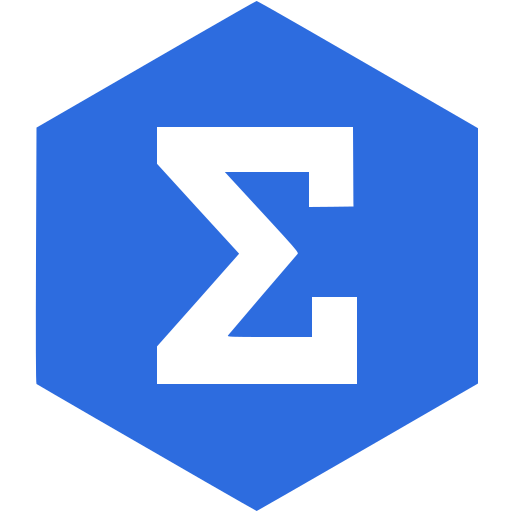

 <b>¤ Languages ¤</b>

  
  
  
  
  
  
  

 <b>¤ Competitive Programming ¤</b>

  
  
  
  
  
  
  
  
  
  

 <b>¤ Organizations ¤</b>

  
  
  
  
  

 <b>¤ Socials ¤</b>

  
  
  
  
  
  
  

  
  
  
  
  
  
  

  

@codeforces
